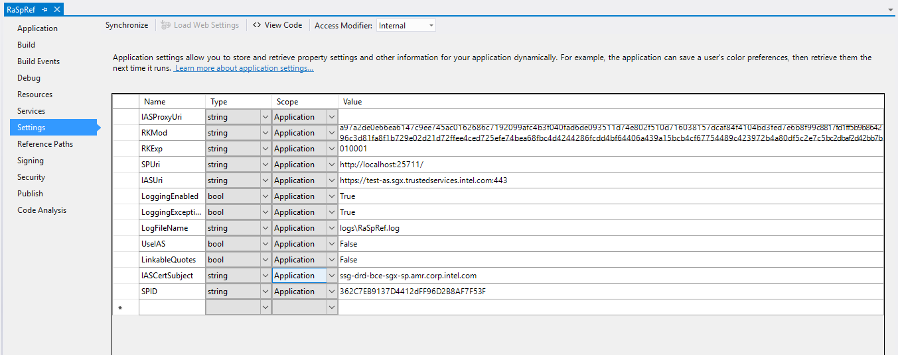

# About
This Repo is the Remote Attestation Package(Designed based on Intel SGX Sample Code RemoteAttestation). This package contains all components which need for remote attestation.

Extended Functionalities compare with Intel SDK1.6 Version:

- Server configuration files with dedicated options.
- Client configuration files with dedicated options.
- Attestation without IAS (Mode offered, available until Intel release Intel Public EPID keys).
- Asynchronized Server Modules Offered.
- One time IAS Attestation mode with time replay.

# Installing and Configuration
The remote attestation contains two part, one is Server components and the other one is Client components which been attested. Server can runs without Intel SGX environment, but Client must require Intel SGX related components.

## Required Components
Make sure that you already have the following installing:

> - **Intel SGX SDK v1.6**
> - **Intel SGX PSW** (Platform Software for Windows) v1.6
> - **NET Framework 4.6.1 Developer Pack**. (Get it from: https://www.microsoft.com/en-us/download/details.aspx?id=49978)
> - **NuGet for Visual Studio**. (For Visual Studio 2012 get it from: https://visualstudiogallery.msdn.microsoft.com/27077b70-9dad-4c64-adcf-c7cf6bc9970c)
> - **IPP 9.0.x** (%For Remtoe Attestation%/Windows/w_ipp_9.0.3.207.exe)
> - **IPP-CP (crypto library)** (%For Remtoe Attestation%/Windows/w_crypto_ipp_p_9.0.3.207.exe)

Please Install all the required components, after installation completed, please follow the next steps to configure environment variables.

> Variable: Value:
> **IPPROOT**: *%ProgramFiles(x86)%\IntelSWTools\compilers_and_libraries\windows\ipp*
> **CPATH**: *%IPPROOT%\include*
> **INCLUDE**: *%IPPROOT%\include*
> **MIC_LD_LIBRARY_PATH**: *%IPPROOT%\lib\mic;*
> **PATH**: *%IPPROOT%\..\redist\intel64\ipp;%IPPROOT%\..\redist\intel64\compiler;*

Please make sure all the environment been successfully and correctly configured. Then please step into the certification installing process.

## Certification Installation

To install connection certification, you need firstly you should have your own private key and register on Intel Attestation Service, then you may receive SPID assigned to you also. Please make sure you have the .pfx file, if you have .pfx file you can directly install it on your computer. Oterwise, please refer Pvk2Pfx (https://msdn.microsoft.com/en-us/library/windows/hardware/ff552958(v=vs.85).aspx) to generate .pfx file for with private key.

## Configuration

After you have complete the installation of all the required components, now you can start the configuration of remote attestation packages. First we start with Server project, open server project in Visual studio 2012 -> **Right Click** Solution Menu -> Select "**Enable Nuget Package Restore**"

